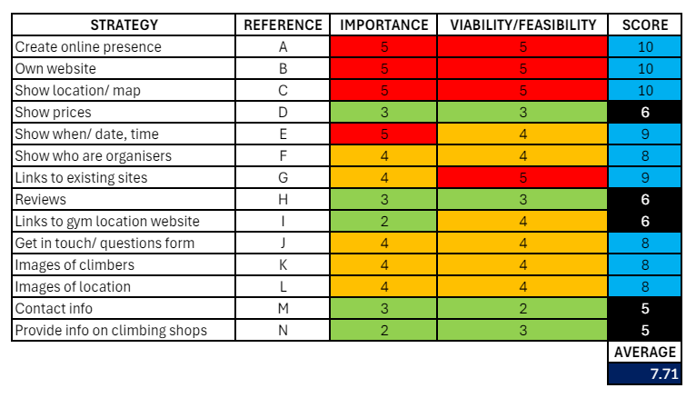
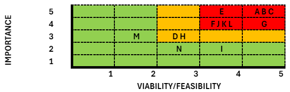
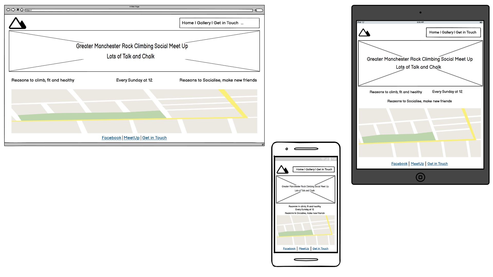
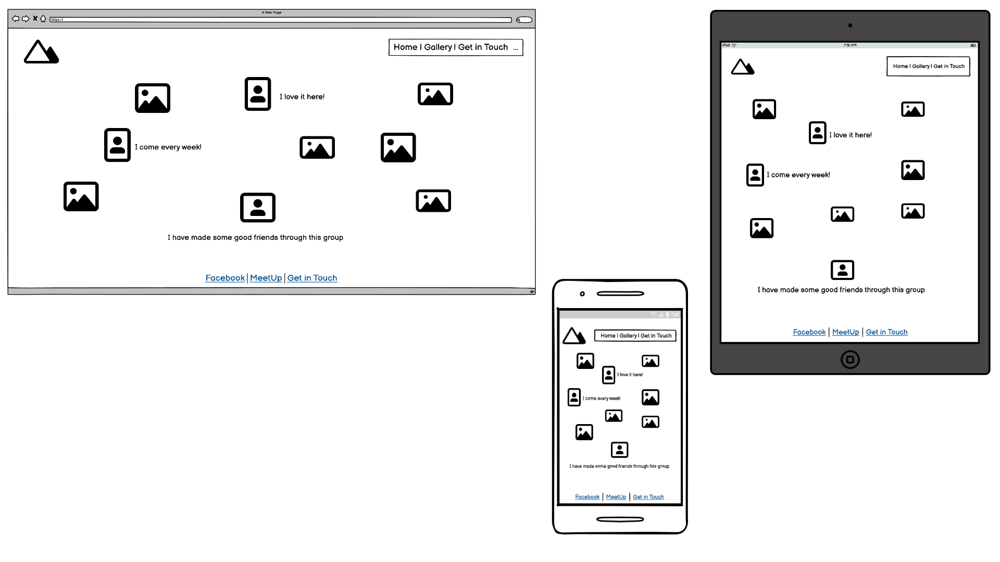
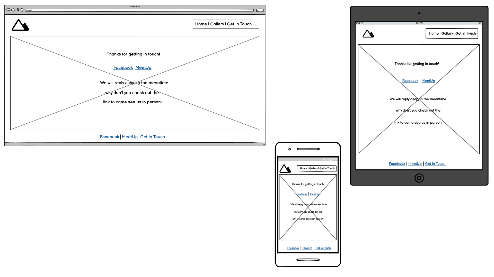

# First Milestone Project for Level 5 Web Developement Applications 

# Greater Manchester Rock Climbing Group

<!-- Insert logo main here with link to location assets -->

## Content list

- [First Milestone Project](#first-milestone-project-for-level-5-web-developement-applications)
- [Greater Manchester Rock Climbing Group](#greater-manchester-rock-climbing-group)
- [Content List](#content-list)
- [About](#about)
- [User Experience](#user-experience-ux)
  - [User Requirements](#user-requirements)
    - [Website Owner Goals](#website-owner-goals)
    - [Website Visitor Goals](#website-visitor-goals)
  - [Strategy Tradeoffs](#strategy-tradeoffs)
    - [Strategy Criteria](#strategy-criteria)
    - [Strategy Table](#strategy-table)
    - [Strategy Assessment](#strategy-assessment)
    - [Strategy Graph](#strategy-graph)
    - [Strategy Reasons](#strategy-reasons)
- [Design](#design)
  - [Colour Scheme](#colour-scheme)
  - [Typography](#typography)
  - [Imagery](#imagery)
  - [Wireframes](#wireframes)
- [Greater Manchester Rock Climbing Group Page Preview](#greater-manchester-rock-climbing-group-page-preview)
  - [Features](#features)
  - [The Home Page](#the-home-page)
  - [The Gallery Page](#the-gallery-page)
  - [The Get In Touch/Form Page](#the-get-in-touchform-page)
  - [The Get In Touch/Form Page Complete Page](#the-get-in-touch-completeform-page-complete)
- [Accessibility](#accessibility)
- [Technologies Used](#technologies-used)
  - [Languages Used](#languages-used)
  - [Frameworks, Libraries and Programs Used](#frameworks-libraries-and-programs-used)
- [Deployment and Local Developement](#deployment-and-local-development)
- [Testing](#testing)
- [Bugs](#bugs)
  - [Solved Bugs](#solved-bugs)
  - [Known Bugs and Resolved Issues](#known-bugs-and-resolved-issues)
- [Credits](#credits)
  - [Code Used](#code-used)
  - [Content](#content)
  - [Media](#media)
  - [Acknowledgments](#acknowledgments)

# About

Greater Manchester Rock Climbing Group is a real group where I volunteer every Sunday. Advertisement for the group has been a mix of [facebook page](#https://www.facebook.com/groups/1530175777232049/) and the [meetup app](#https://www.meetup.com/greater-manchester-rock-climbing/events/vndsltygchbzb/). I wanted to create a single website that links everything together and is easily accessible.

## User Experience (UX)

### User Requirements

#### Website Owner Goals

- The website should attract new members and grab the attention of the user.
- Make the website clear, easy to use, not have to much information and clearly show the goal.
- Ensure all relevant links to existing external websites are accessible on all pages of the website.
- Also to make the website responsive on all devices.

#### Website Visitor Goals

- The site to be easy to navigate, with clear instructions on where to book.
- The site to have clear instructions on where and when the group takes place.
- To be able to see reviews and images of existing members, also images of the location.
- To be able to see what the group offers.

### Strategy Tradeoffs

#### Strategy Criteria
 - To decide what features the website should have for it's users. I created a [table](#strategy-table) and listed 14 main criteria. Then following UX strategy I came up with a solution on which were most important and which could be traded off.
 - The strategy used was to give each of the criteria a score, the first being importance, how crucial is this for the user? The second being viability/feasibility, how realistic is it that we implement this for the user? 
 - The following table shows the results of this strategy.

#### Strategy Table

  

#### Strategy Assessment 

- When creating the table, I first tallied the two criteria requirements, then added the totals to calculate the average score. As seen in the table the average was 7.71.
- The next stage was to plot these results in a colour coded strategy graph. Red being the most relevant and green being the least. All criteria that was above the average score can been deemed most relavant to be included in the website.

#### Strategy Graph

 

#### Strategy Reasons

- The table below documents the reasons why each part of the criteria was used, or not, in the final website. The reason section shows how I judged each criteria to see if it was important and viable/feasible.

| Goal Criteria | Reference | Importance Score | Viability/Feasibility Score | Reason |
| :--- | :--- | :--- | :--- | :--- |
| Create online presence | A | 5 | 5 | Easiest way to gather new members. |
| Own Website | B | 5 | 5 | Better consolidation of existing online resources |
| Show location/ map | C | 5 | 5 | Essential. |
| Show prices | D | 3 | 3 | Different prices for gym and meet up group (All explained on website link). |
| Show when/ date, time | E | 5 | 4 | Essential. |
| Show who are organisers | F | 4 | 4 | Good idea to show faces. |
| Links to existing sites | G | 4 | 5 | Essential. |
| Reviews | H | 3 | 3 | Good idea but will need to ask existing members in person. |
| Links to gym location website | I | 2 | 4 | Not needed, need to steer users towards the dedicated links. |
| Get in touch/ questions form | J | 4 | 4 | Good idea for collecting FAQs.  |
| Images of climbers | K | 4 | 4 | Good idea to show what it looks like. |
| Images of location | L | 4 | 4 | Good idea to show what it looks like. |
| Contact info | M | 3 | 2 | Not needed, form and links covers this |
| Provide info on climbing shops | N | 2 | 3 | Not suited for the main goal |

---

# Design

### Colour Scheme

### Typography

### Imagery

### Wireframes

[balsamiq](https://balsamiq.com/) was used to create wireframes for mobile, tablet and desktop views.

#### Home Page

#### Gallery Page

#### Get in Touch Page

#### Get in Touch Page Completed Form Page

# Greater Manchester Rock Climbing Group Page Preview

<!-- insert responsive image of all views on mobile table desktop -->

### Features

The website is comprised of 4 pages in total, a home page, a gallery page, a get in touch/form page and a get in touch/form complete page.

All the pages are responsive and have the website logo at the top which also serves as a link back to the home page. <!-- insert logo here -->

#### The Home Page

<!-- insert full description of the home page and a screenshot -->

#### The Gallery Page

<!-- insert full description of the gallery page and a screenshot -->

#### The Get In Touch/Form Page

<!-- insert full description of the form page and a screenshot -->

#### The Get In Touch Complete/Form Page Complete

<!-- insert full description of the form-complete page and a screenshot -->

### Accessibility

<!-- insert proof of accessibility alt on image semantic html etc -->

---

## Technologies Used

### Languages Used

HTML and CSS

### Frameworks, Libraries and Programs Used

* [Balsamiq](https://balsamiq.com/) - Used to create wireframes.

* [Git](https://git-scm.com/) - For version control.

* [Github](https://github.com/) - To save and store the files for the website.

* [VSCode](https://vscode.dev/) - IDE used to build the site.

* [Google Fonts](https://fonts.google.com/) - To import the fonts used on the website.

* [Bootstrap 5](https://www.bootstrapcdn.com/) - Used for layout and responsive design.

* [Font Awesome](https://www.bootstrapcdn.com/fontawesome/) - Used for icons.

* [Google Developer Tools](https://developers.google.com/web/tools) - To troubleshoot and test features, solve issues with responsiveness and styling.

* [Am I Responsive?](http://ami.responsivedesign.is/) To show the website image on a range of devices.

* [Web Disability Simulator](https://chrome.google.com/webstore/detail/web-disability-simulator/olioanlbgbpmdlgjnnampnnlohigkjla) - a google chrome extension that allows you to view your site as people with accessibility needs would see it.

## Deployment and Local Development

### Deployment

The site is deployed using GitHub Pages - [Al3x-G/Gm-RockClimbing](https://github.com/Al3x-G/GM-RockClimbing).

To Deploy the site using GitHub Pages:

1. Login (or signup) to Github.
2. Go to the repository for this project, [Al3x-G/Gm-RockClimbing](https://github.com/Al3x-G/GM-RockClimbing).
3. Click the settings button.
4. Select pages in the left-hand navigation menu.
5. From the source dropdown select main branch and press save.
6. The site has now been deployed, please note that this process may take a few minutes before the site goes live.

### Local Development

#### How to Fork

To fork the repository:

1. Log in (or sign up) to Github.
2. Go to the repository for this project, [Al3x-G/Gm-RockClimbing](https://github.com/Al3x-G/GM-RockClimbing).
3. Click the Fork button in the top right corner.

#### How to Clone

To clone the repository:

1. Log in (or sign up) to GitHub.
2. Go to the repository for this project, [Al3x-G/Gm-RockClimbing](https://github.com/Al3x-G/GM-RockClimbing).
3. Click on the code button, select whether you would like to clone with HTTPS, SSH or GitHub CLI and copy the link shown.
4. Open the terminal in your code editor and change the current working directory to the location you want to use for the cloned directory.
5. Type 'git clone' into the terminal and then paste the link you copied in step 3. Press enter.

- - -

## Testing

Please refer to [Testing.md](testing.md) file for all testing results.

## Bugs

### Solved Bugs

<!-- insert table of all solved bugs during website build -->

### Known Bugs and Resolved Issues

<!-- insert any known/solve bugs issues that occurred during build -->

## Credits

### Code Used

* For the Google maps iframe I used the code from [google maps generator](https://maps-google.github.io/embed-google-map/), this was the most efficient way of incorporating the map on the home page.

<!-- include any code used here in bullet points -->

### Content

All Information on the website is accurate at the time of the build (May 2024) and represents a real world meet up social group, which I attend and voluteer to run. This website will have further iterations in the future to become fit for purpose as a functional website. 

### Media

All the pictures through the pages of the website are owned and taken by me, with permission granted by the subjects in the images.

### Acknowledgments

I would like to take this opportunity acknowledge the following:

* Code Institute - For all the incredible resources and lessons that have made this project possible, I have really enjoyed this process so far!

* Newcastle College - For your efforts facilitating this course.

* E Hammond - a fellow student that was recommended, on allowing me to learn how to structure a README.md file from her awesome repository [country hotel](https://github.com/e-h-dev/country-hotel/tree/main)

* Kimberley Wolstenhulme - for her ongoing support and help decision making.