# Greater Manchester Rock Climbing Group Testing

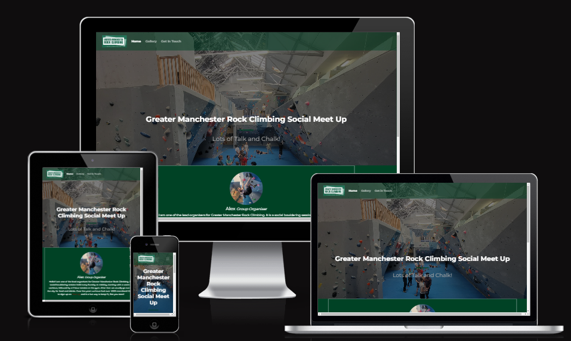

Visit the deployed site: [GM-RockClimbing](https://al3x-g.github.io/GM-RockClimbing/)

- - -

## CONTENTS

* [Automated Testing](#automated-testing)
  * [W3C Validator](#w3c-validator)
  * [Lighthouse](#lighthouse)
* [Manual Testing](#manual-testing)
  * [Testing User Stories](#testing-user-stories)
  * [Full Testing](#full-testing)

I used Chrome developer tools extensively, whilst building the website to ensure everything was working correctly and pinpoint and troubleshoot any errors or bugs.

I also used google chrome developer tools through each page to ensure that each page is responsive on a variety of different screen sizes and devices.

- - -

## Automated Testing

### W3C Validator

I used [W3C Validator](https://validator.w3.org/) to validate the HTML on all pages of the website.

I used [W3C Jigsaw Validator](https://jigsaw.w3.org/css-validator/) to validate the CSS file.

#### Home Page

PASSED

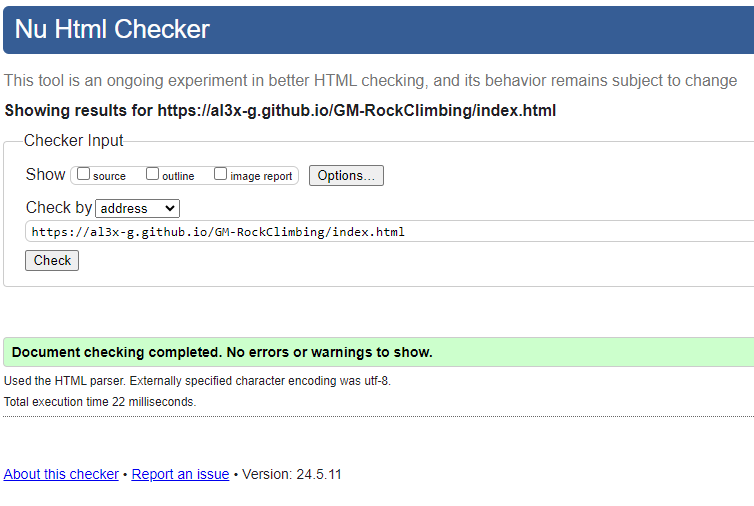

#### Gallery Page

PASSED

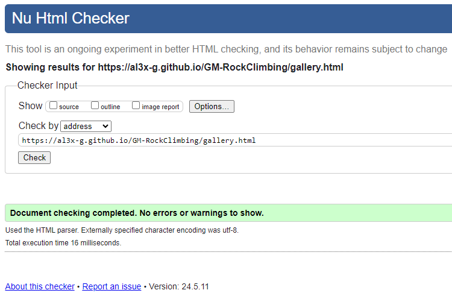

#### Get in Touch/ Form Page

PASSED

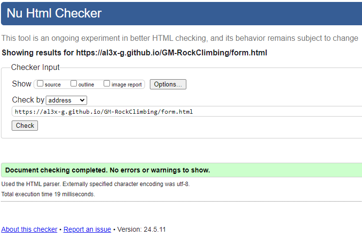

#### Thanks for Getting in Touch/ Form Complete Page

PASSED

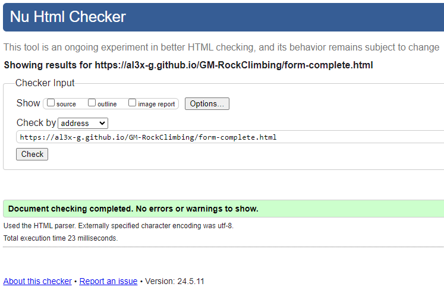

#### Style Sheet (css)

PASSED 

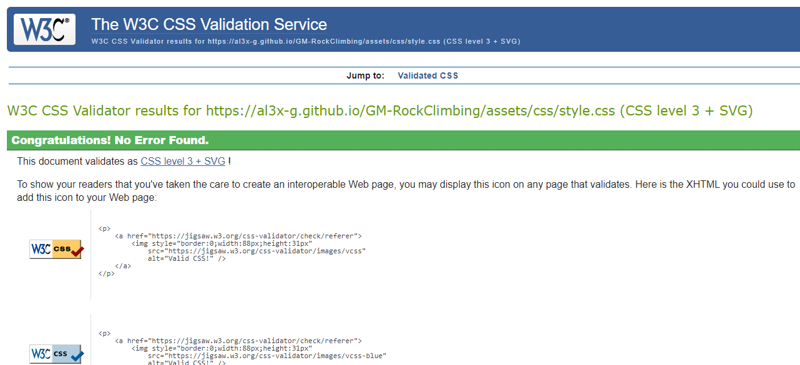

### Lighthouse.

I have tested all the website pages with lighthouse using the chrome developer tools.

#### Home Page

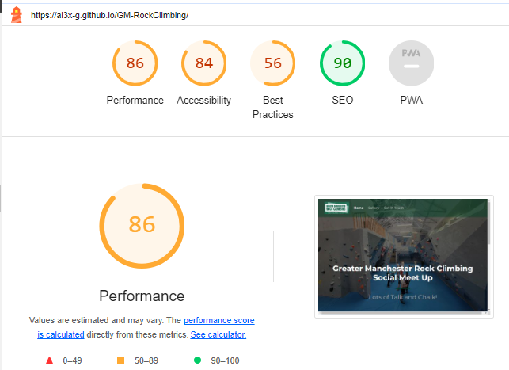

#### Gallery Page

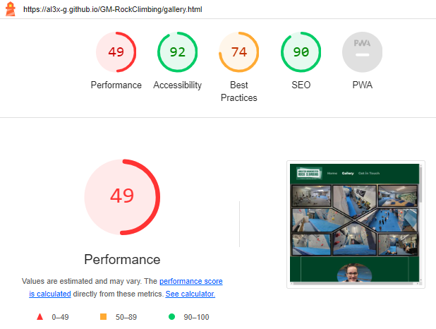

#### Get in Touch/ Form Page

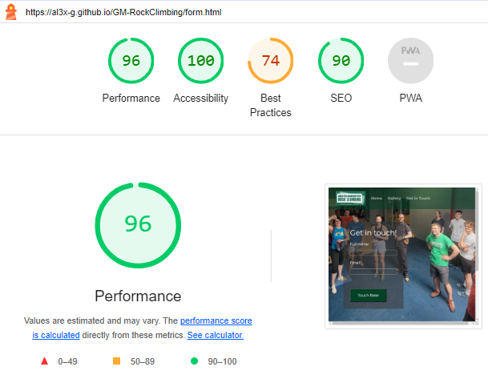

#### Thanks for Getting in Touch/ Form Complete Page

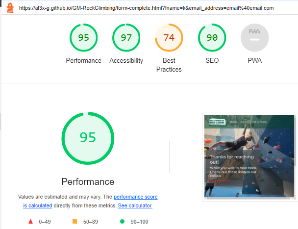

- - -

## MANUAL TESTING

### Testing User Stories

For each of the user goals, I have assigned with a reference from A - I. 

Each goal is supported below with a screenshot of the website, proving the goal was accomplished.

#### Website Owner Goals.

| REF | Goals | How are they achieved? |
| :--- | :--- | :--- |
| A | The website should attract new members and grab the attention of the user. | The landing page has a big bright hero image with easy to read text. |
| B | Make the website easy to use, clearly show the goal with not too much information. | Simple but effective nav bar and a clear concise explantion on the landing page centrally located.  |
| C | Ensure all relevant links to existing external websites are accessible on all pages of the website. | Links are in the footer on every page with an extra links on the landing page and the completed form page |
| D | Also to make the website responsive on all devices. | Using bootstrap and CSS styles to ensure compatability. |

#### Website Visitor Goals.

| REF | Goals | How are they achieved? |
| :--- | :--- | :--- |
| E | The site to be easy to navigate, with clear instructions on where to book. | Simple effective nav bar and a specific link inside the text on the landing page explaining where to book. |
| F | The site to have clear instructions on where and when the group takes place. | A clear concise explantion on the landing page centrally located with a google maps iframe showing the address and location. |
| G | To be able to see reviews and images of existing members, also images of the location. | Achieved on the gallery page. |
| H | To be able to see what the group offers. | A clear concise explanation on the landing page centrally located |

#### Screenshots for Goals

### Goal A and D

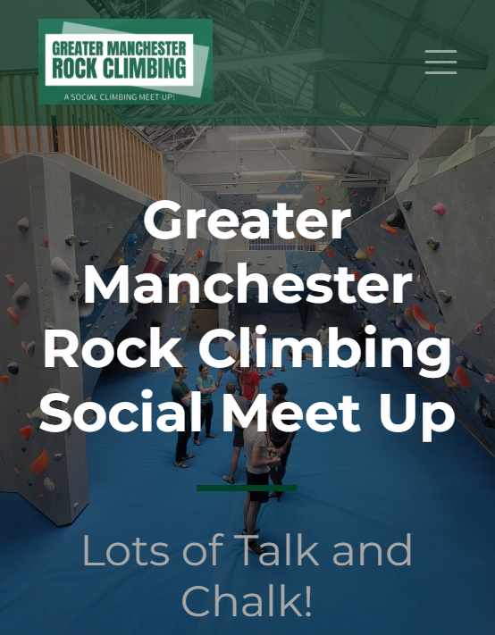

### Goal B and E

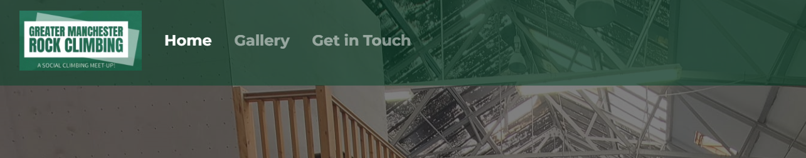

### Goal B

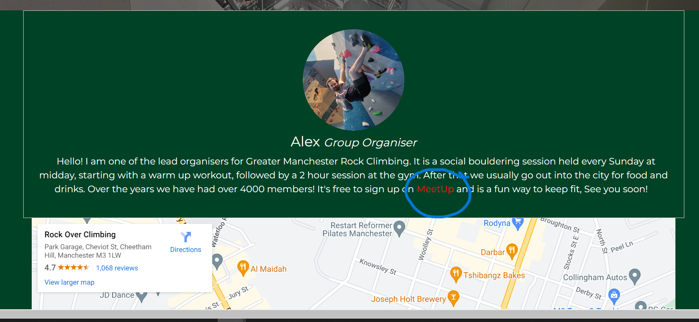

### Goal C

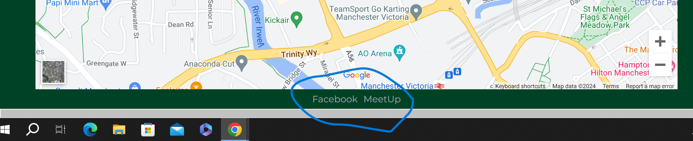

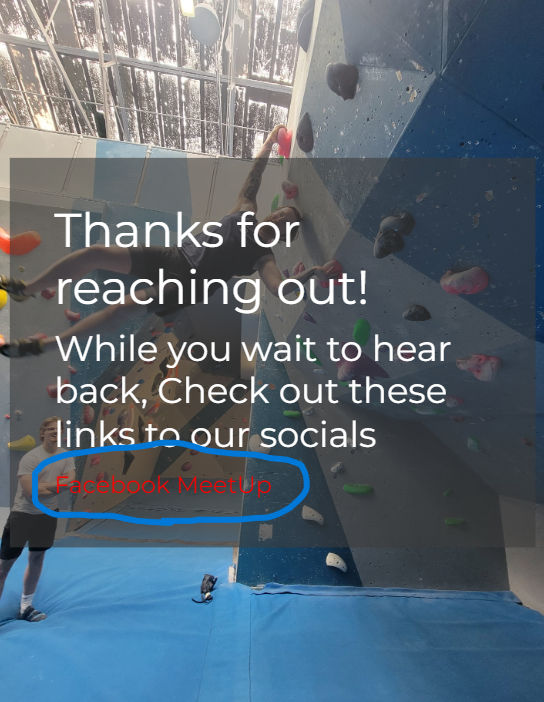

### Goal E and H

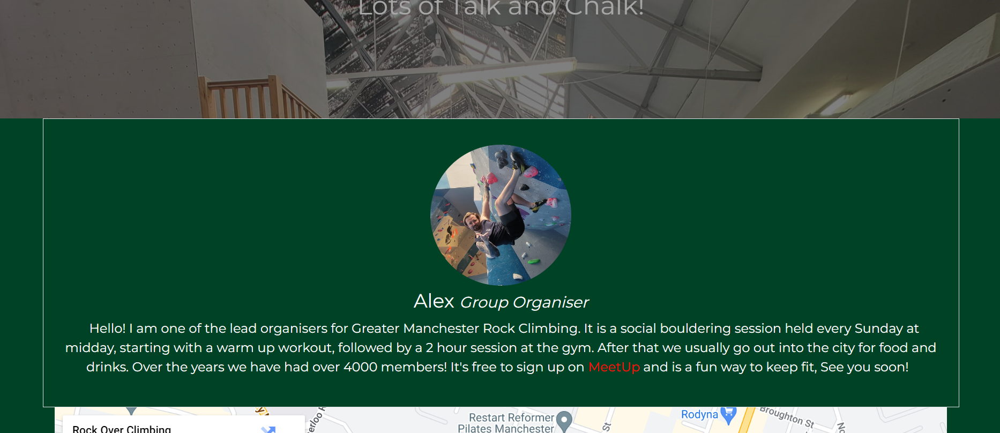

### Goal f

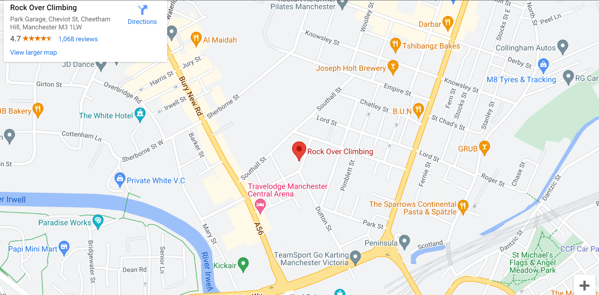

### Goal G

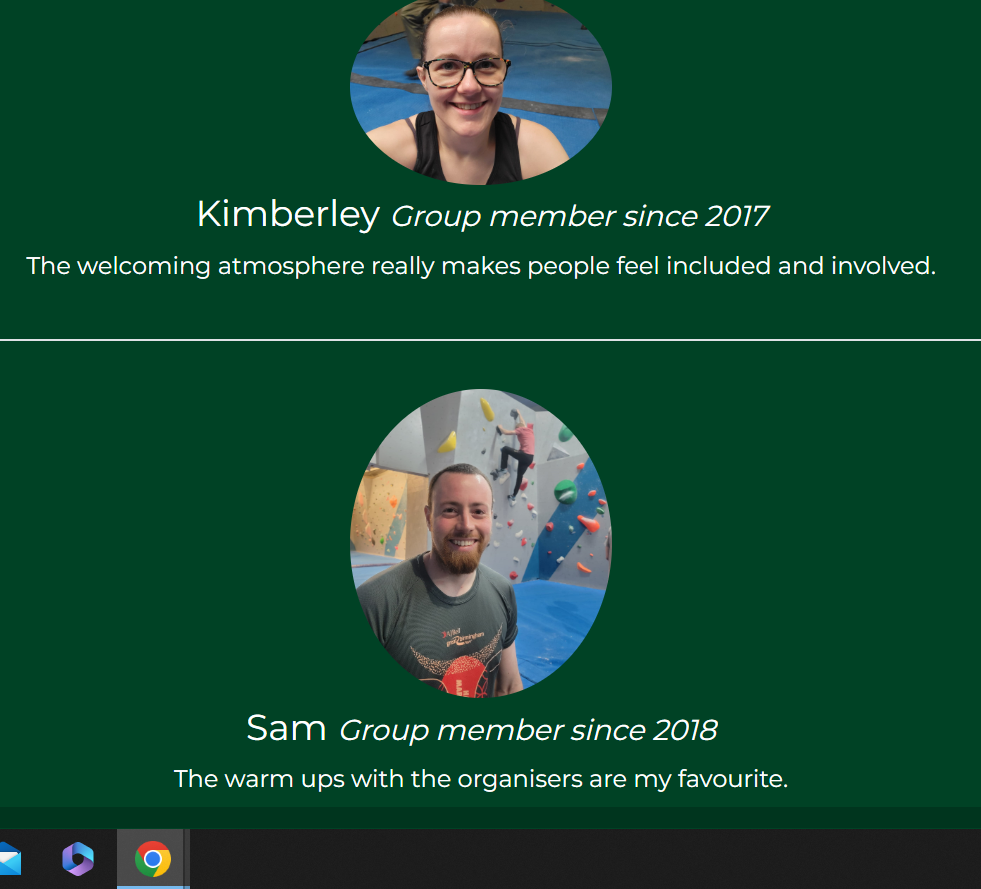

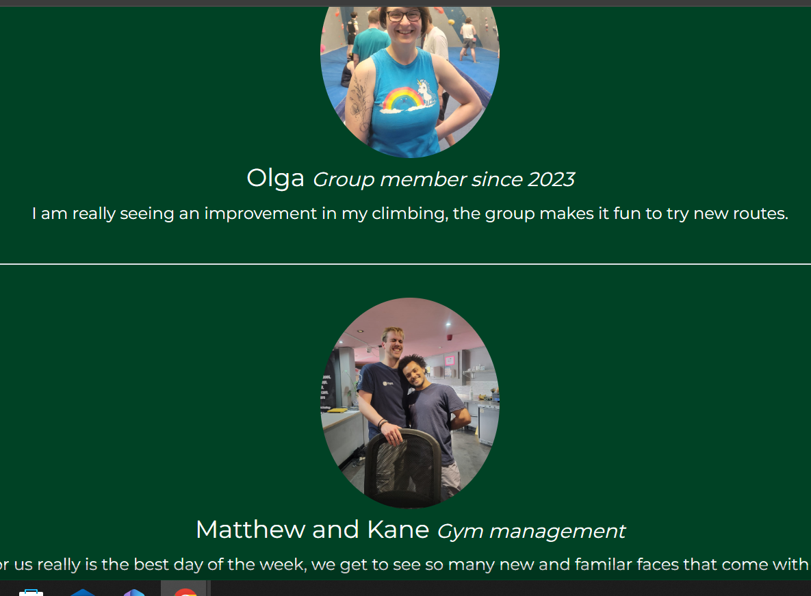

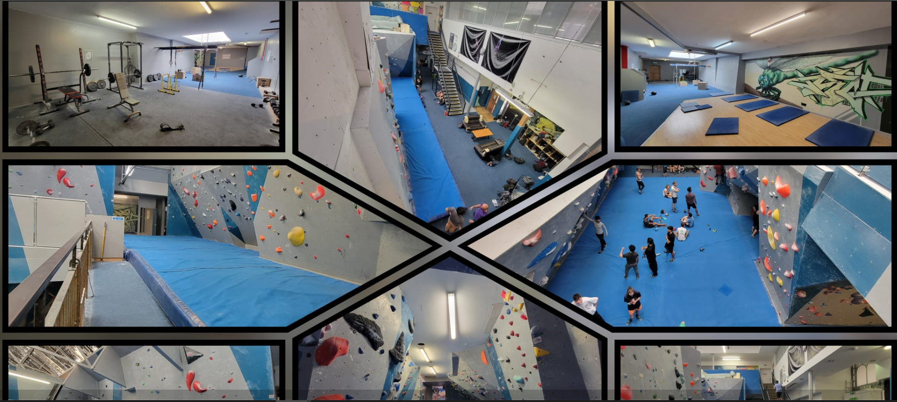

### Goal D

---

### Full Testing

Full testing was performed on a range of devices:

* A desktop
* Laptops and chromebooks.
* Android tablet.
* Android Mobile Devices.

The website was tested on the following browsers with no issues:

* Google Chrome
* Microsoft Edge
* Firefox
* Opra

Additional testing was taken by friends, family and members of the climbing group on a variety of devices and screen sizes. They reported no issues when browsing and actually liked the site!

### Home Page

| Feature | Expected Outcome | Testing Performed | Result | Pass/Fail |
| --- | --- | --- | --- | --- |
| The logo in the header | Link directs the user back to the home page | Clicked logo | Home page reloads | Pass |
| Nav Bar | Hovering cursor over each link it changes to light colour | Hovered over links | Colour of links changed | Pass |
| Home link | Link directs the user to the home page | Clicked link | Home page reloads | Pass |
| Gallery link | Link directs the user to the gallery page | Clicked link | Gallery page loads | Pass |
| Get in Touch link | Link directs the user to get in touch page | Clicked link | Get in touch page loads | Pass |
| Nav bar Dropdown | On smaller screens the nav bar should compress to a burger icon and dropdown when clicked to show the links | Clicked Icon | Works on mobile and small tablet | Pass |
| Google map | Map should show location and should be interactive | Map shows correct location, map zooms in and out can change map type view and can move the map | Desired outcome achieved | Pass |
| Social links | Should open new tab to the group's social pages on Facebook and meetup | Click on links | New tab opens with group's page of selected social media. | Pass |

### Gallery Page

| Feature | Expected Outcome | Testing Performed | Result | Pass/Fail |
| --- | --- | --- | --- | --- |
| The logo in the header | Link directs the user back to the home page | Clicked title | Home page loads | Pass |
| Nav Bar | Hovering cursor over each link it changes to light colour | Hovered over links | Colour of links changed | Pass |
| Home link | Link directs the user to the home page | Clicked link | Home page loads | Pass |
| Gallery link | Link directs the user to the gallery page | Clicked link | Gallery page reloads | Pass |
| Get in Touch link | Link directs the user to get in touch page | Clicked link | Get in touch page loads | Pass |
| Nav bar Dropdown | On smaller screens the nav bar should compress to a burger icon and dropdown when clicked to show the links | Clicked Icon | Works on mobile and small tablet | Pass |
| Social links | Should open new tab to the group's social pages on Facebook and meetup | Click on icon | New tab opens with group's page of selected social media. | Pass |

### Get in Touch Page

| Feature | Expected Outcome | Testing Performed | Result | Pass/Fail |
| --- | --- | --- | --- | --- |
| The logo in the header | Link directs the user back to the home page | Clicked title | Home page loads | Pass |
| Nav Bar | Hovering cursor over each link it changes to light colour | Hovered over links | Colour of links changed | Pass |
| Home link | Link directs the user to the home page | Clicked link | Home page loads | Pass |
| Gallery link | Link directs the user to the gallery page | Clicked link | Gallery page loads | Pass |
| Get in Touch link | Link directs the user to get in touch page | Clicked link | Get in touch page reloads | Pass |
| Nav bar Dropdown | On smaller screens the nav bar should compress to a burger icon and dropdown when clicked to show the links | Clicked Icon | Works on mobile and small tablet | Pass |
| Social links | Should open new tab to the group's social pages on Facebook and meetup | Click on icon | New tab opens with group's page of selected social media. | Pass |
| Form Input hover | Should change to a lighter colour when hovering over the input fields and button | Hovered with mouse | Desired effect was achieved | Pass |
| Form Input Name and Email | Should change to lighter background colour when filled in and only allow name and email | Completed form using correct details | Desired outcome was achieved | Pass |
| Form Input Name and Email | Should not be allowed to use submit button with empty fields | Pressed submit button and a prompt appeared asking for the fields to be filled in | Desired outcome was achieved | Pass |
| Form Input Name and Email | Pressing submit button with correct filled in fields should direct user to the form complete page | Pressed submit button | Desired outcome was achieved | Pass |

### Form completed Page

| Feature | Expected Outcome | Testing Performed | Result | Pass/Fail |
| --- | --- | --- | --- | --- |
| The logo in the header | Link directs the user back to the home page | Clicked title | Home page loads | Pass |
| Nav Bar | Hovering cursor over each link it changes to light colour | Hovered over links | Colour of links changed | Pass |
| Home link | Link directs the user to the home page | Clicked link | Home page loads | Pass |
| Gallery link | Link directs the user to the gallery page | Clicked link | Gallery page loads | Pass |
| Get in Touch link | Link directs the user to get in touch page | Clicked link | Get in touch page loads | Pass |
| Nav bar Dropdown | On smaller screens the nav bar should compress to a burger icon and dropdown when clicked to show the links | Clicked Icon | Works on mobile and small tablet | Pass |
| Social links | Should open new tab to the group's social pages on Facebook and meetup | Click on icon | New tab opens with group's page of selected social media. | Pass |
